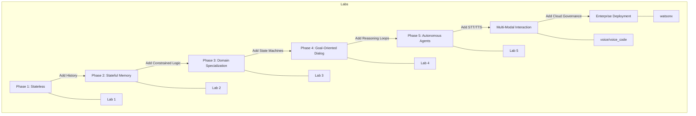

# Project Summary: The AI Agent Learning Path

This document serves as a capstone for the `openai-bot` project, mapping the evolution from simple API calls to complex, autonomous, multi-modal AI agents.

## 🚀 The Evolution of an AI Agent

Building AI applications is not just about "prompting." It involves a progression through increasingly complex Computer Science patterns: **Persistence**, **State Machines**, **Modality Orchestration**, and **Autonomous Logic Loops**.

### Mermaid: Architectural Evolution Path

---

## 📂 Learning Path Breakdown

### 1. Foundations: Stateless to Stateful
- **Labs:** [Lab-1](file:///Users/ivanp/Downloads/openai-bot/Lab-1/summary.md), [Lab-2](file:///Users/ivanp/Downloads/openai-bot/Lab-2/summary.md)
- **Core Concept:** Moving from a single request-response to a continuous conversation.
- **CS Technique:** Implementing **Session State** (`st.session_state`) to maintain context window history.

### 2. Guardrails: Domain & Logic
- **Labs:** [Lab-3](file:///Users/ivanp/Downloads/openai-bot/Lab-3/summary.md), [Lab-4](file:///Users/ivanp/Downloads/openai-bot/Lab-4/summary.md)
- **Core Concept:** Forcing the LLM into a specific persona or goal.
- **CS Technique:** Using **System Prompts** for persona engineering and **Finite State Machines (FSM)** with Regex for deterministic data extraction.

### 3. Autonomy: The ReAct Pattern
- **Labs:** [Lab-5](file:///Users/ivanp/Downloads/openai-bot/Lab-5/summary.md)
- **Core Concept:** Agents that can use "tools" (calculators, search, databases) to solve problems they can't solve with weights alone.
- **CS Technique:** The **Reasoning Loop**—an iterative `while`-loop where the model decides when to call a function and how to interpret the observation.

### 4. Modalities: Beyond Text
- **Folders:** [voice](file:///Users/ivanp/Downloads/openai-bot/voice/summary.md), [voice_code](file:///Users/ivanp/Downloads/openai-bot/voice_code/summary.md)
- **Core Concept:** Cascading multiple AI models (STT -> LLM -> TTS).
- **CS Technique:** Handling **Binary Streams**, Modality **Transcoding** (MP3/PCM), and asynchronous **UI updates**.

### 5. Enterprise: Governance & Tuning
- **Folders:** [watsonx](file:///Users/ivanp/Downloads/openai-bot/watsonx/summary.md)
- **Core Concept:** Productionizing AI in regulated environments.
- **CS Technique:** **Hyperparameter Tuning** (Temperature, Top-P) and **IAM Authentication** via Enterprise SDKs.

---

## 🛠️ Key Technical Takeaways

1. **Tokens are State**: Every conversation is just a growing list of tokens. Managing this list (pruning, summarizing) is the primary engineering challenge of LLM apps.
2. **Determinism vs. Probabilistic**: Use LLMs for what they are good at (language/reasoning) but use Regex/FSMs for what they are bad at (formatting/exact data extraction).
3. **Safety First**: Autonomous loops MUST have termination conditions (`max_iterations`) to prevent runaway execution.
4. **Modularity Matters**: Separating the "Thinking" (LLM) from the "Doing" (Tools/UI) allows you to swap models or interfaces without rewriting the core agent logic.
