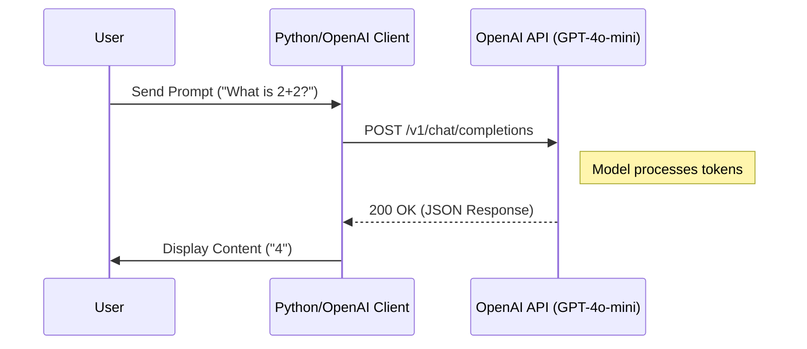
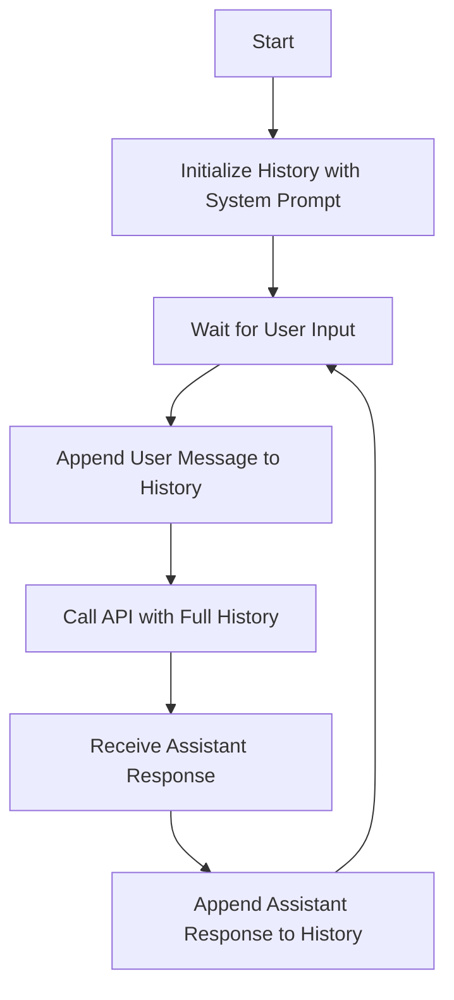
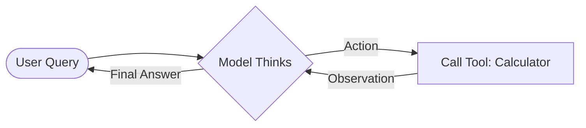

# Lab 1 Summary: Generative AI Fundamentals

This document provides a technical overview of the examples found in the `Lab-1` folder, focusing on OpenAI API integration, stateful conversational loops, and basic AI agents.

## 🚀 Overview

Lab 1 introduces the core mechanics of interacting with Large Language Models (LLMs) via API. In computer science terms, we transition from **Stateless Request/Response** patterns to **Stateful Conversational Flows** and eventually **Autonomous Agent Loops**.

---

## 1. Basic Request-Response Flow
**Examples:** [openai_chat.ipynb](file:///Users/ivanp/Downloads/openai-bot/Lab-1/openai_chat.ipynb)

The simplest interaction with an LLM is a single `chat.completions.create` call. You provide a prompt (Input) and receive a completion (Output).

### Sequence Diagram: Basic Call

---

## 2. Conversation History & Roles
**Examples:** [example.py](file:///Users/ivanp/Downloads/openai-bot/Lab-1/example.py), [azure_chatbot.py](file:///Users/ivanp/Downloads/openai-bot/Lab-1/azure_chatbot.py)

Models are technically stateless. To create a "chat" experience, we must maintain a list of messages (history) and resend it with every new user input.

### Key Roles
- `system`: Defines the assistant's persona (e.g., "You are a pirate").
- `user`: The input from the person.
- `assistant`: The model's previous responses.

### Flowchart: Stateful Loop

---

## 3. Web Interfaces with Streamlit
**Examples:** [generic_openai_chatbot.py](file:///Users/ivanp/Downloads/openai-bot/Lab-1/generic_openai_chatbot.py)

Using **Streamlit**, we wrap the Python logic in a reactive web UI. This demonstrates how to handle asynchronous API calls within a frontend framework.

---

## 4. AI Agents & Tool Use (ReAct)
**Examples:** [01_math_agent.ipynb](file:///Users/ivanp/Downloads/openai-bot/Lab-1/01_math_agent.ipynb)

This is the most advanced pattern in Lab 1. Instead of just "chatting," the model is given **Tools** (like a calculator) and uses a **ReAct (Reason + Act)** loop to solve problems.

### Mermaid: ReAct Agent Loop

---

## 🛠️ CS Technical Notes

- **Environment Isolation**: Always use `.env` files ([.env.sample](file:///Users/ivanp/Downloads/openai-bot/.env.sample)) to avoid hardcoding secrets.
- **Error Handling**: Use `try/except` blocks to handle network timeouts or API rate limits, as seen in `example.py`.
- **Security Warning**: In `01_math_agent.ipynb`, notice the use of `eval()`. In a real-world CS application, `eval()` is dangerous and should be replaced with safe parsers (like `ast.literal_eval`).
- **Token Management**: Larger histories increase latency and cost. Implement history pruning (e.g., keeping only the last 10 messages) in production systems.
