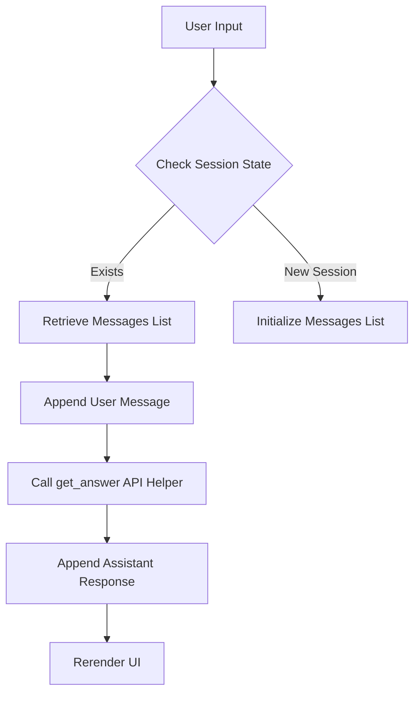
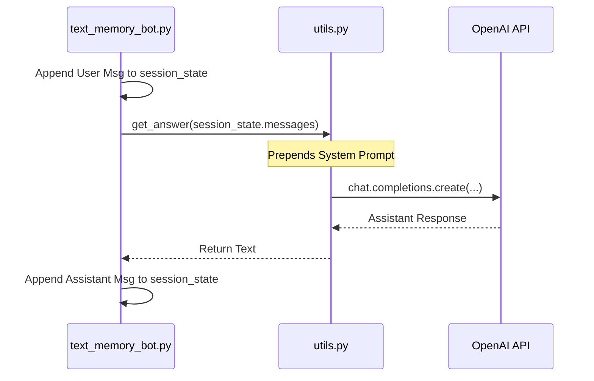

# Lab 2 Summary: State Management & Memory

This document explains the technical implementation of **Conversation Memory** using Streamlit's session state and modular Python functions.

## 🚀 Overview

In Lab 1, we learned how to make a single request. In Lab 2, we tackle **Persistence**. Because HTTP and LLM APIs are stateless, we must manage the "Conversation State" manually on the client side to provide a coherent user experience.

---

## 1. State Management with Streamlit
**Examples:** [text_memory_bot.py](file:///Users/ivanp/Downloads/openai-bot/Lab-2/text_memory_bot.py)

Streamlit re-runs the entire script from top to bottom on every user interaction. To prevent the chatbot from "forgetting" everything, we use `st.session_state`.

### Mermaid: Session State Flow

---

## 2. Modular Design & Helpers
**Examples:** [utils.py](file:///Users/ivanp/Downloads/openai-bot/Lab-2/utils.py)

As applications grow, we separate **Logic** (API calls) from **UI** (Streamlit). 
- `utils.py`: Contains the `get_answer()` function which handles the OpenAI client and system prompts.
- `text_memory_bot.py`: Handles display logic and session state orchestration.

### Sequence Diagram: Modular Interaction

---

## 3. Beyond Text: Multi-modal Support
**Examples:** [utils.py](file:///Users/ivanp/Downloads/openai-bot/Lab-2/utils.py) hooks for Whisper/TTS.

The `utils.py` file includes boilerplate for:
- **STT (Speech-to-Text)**: Using `whisper-1`.
- **TTS (Text-to-Speech)**: Using `tts-1`.
This demonstrates how a single stateful session can evolve to handle different input/output modalities while maintaining the same conversation context.

---

## 🛠️ CS Technical Notes

- **System Prompt Injection**: Notice in `utils.py` ([L11-13](file:///Users/ivanp/Downloads/openai-bot/Lab-2/utils.py#L11-13)), the system message is prepended *every* time the function is called. This ensures the model's persona is consistent regardless of history length.
- **Token Complexity**: 
    - **Lab 1**: $O(1)$ scaling (single message).
    - **Lab 2**: $O(N)$ scaling where $N$ is conversation length. Every turn sends all previous turns.
- **Session Serialization**: `st.session_state` is stored in the server's memory per user session. For production scaling, you would move this to a database (Redis/PostgreSQL).
- **Context Window**: Eventually, the history will exceed the model's `max_tokens`. A robust CS implementation would use a "Sliding Window" or "Summarization" technique to truncate history.
