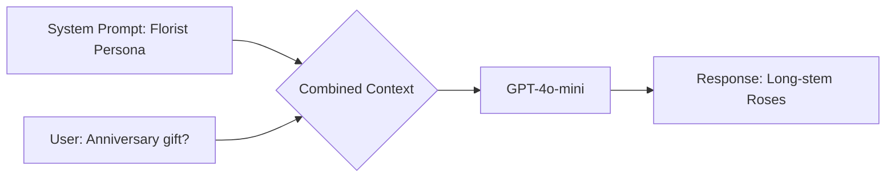
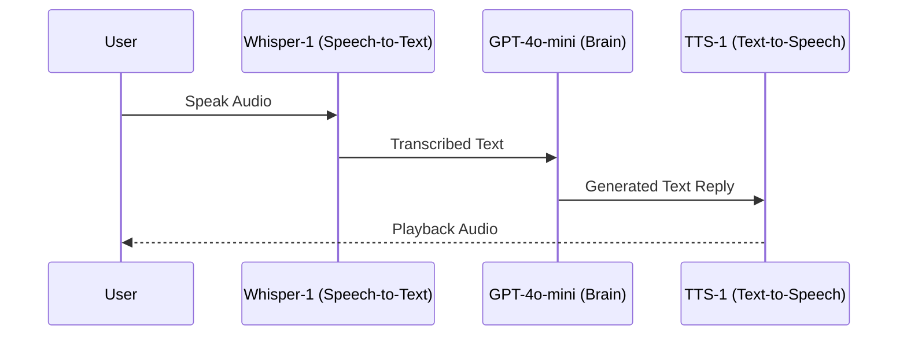

# Lab 3 Summary: Domain Specialization & Voice Modality

This document covers the technical implementation of **Task-Specific Personas** and the architecture of **Voice-Enabled pipelines**.

## 🚀 Overview

In Lab 3, we move from generic assistants to specialized agents (e.g., BloomBot). We also explore how to bridge the gap between human voice (analog) and text-based LLMs (digital).

---

## 1. Domain Specialization (System Prompting)
**Examples:** [flower_bot.py](file:///Users/ivanp/Downloads/openai-bot/Lab-3/flower_bot.py)

The core technique for creating specialized agents is **System Prompting**. By defining a strict identity and set of constraints *before* the conversation starts, we influence the model's behavior, tone, and knowledge focus.

### Mermaid: Specialization Flow

---

## 2. Voice-Enabled Pipeline (VUI)
**Examples:** [utils.py](file:///Users/ivanp/Downloads/openai-bot/Lab-3/utils.py)

Building a voice assistant requires a multi-stage pipeline. The LLM acts as the "Brain," but we need "Ears" and "Voice."

### Mermaid: Voice Interaction Loop

---

## 3. Fallback & Logic Injection
**Technical Detail:** `generate_reply` and `llm_get_answer` in `flower_bot.py`.

Lab 3 demonstrates how to build robust systems using conditional logic:
1.  **Check for LLM**: Does the `utils.py` helper work?
2.  **Logic Injection**: Explicitly prepending the System Prompt if it's not present ([L35-36](file:///Users/ivanp/Downloads/openai-bot/Lab-3/flower_bot.py#L35-36)).
3.  **Heuristic Fallback**: Using keyword matching (`"birthday"`, `"anniversary"`) to provide static answers if API calls fail or are unavailable.

---

## 🛠️ CS Technical Notes

- **Modality Latency**: Every hop in the voice pipeline adds latency (~500ms for STT, ~1s for LLM, ~500ms for TTS). For CS students, optimizing this (e.g., using streaming) is a key challenge.
- **Transcoding**: Note the use of `base64` and `webm/mp3` in `utils.py`. In VUIs, managing audio formats for browser compatibility is just as important as the AI logic.
- **Prompt Engineering as Code**: Instead of hardcoding prompts in every UI, we define `SYSTEM_PROMPT` as a constant. This allows for easier testing and A/B versioning of the "Agent Logic."
- **Session state persistence**: Continues using `st.session_state` to ensure the persona and history remain intact across Streamlit reruns.
