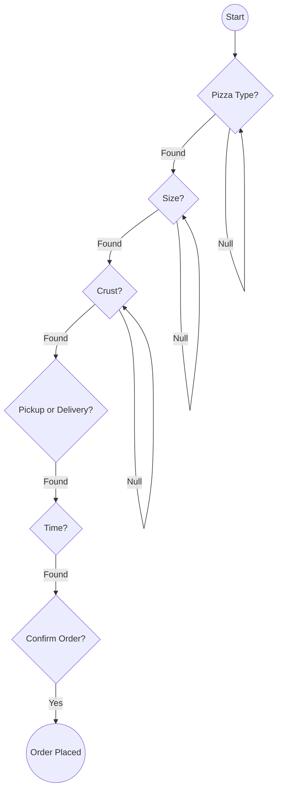

# Lab 4 Summary: Goal-Oriented Dialog Systems

This document explores the implementation of a **Pizza Ordering Bot** specifically looking at controlled state transitions and entity extraction without a generative LLM (as a fallback/starter pattern).

## 🚀 Overview

In Lab 4, we move from generic chatting to a **Goal-Oriented** system. The objective is clear: collect $N$ pieces of information to complete a transaction. This is a classic "Slot-Filling" problem in Natural Language Processing (NLP).

---

## 1. The Order State Machine
**Examples:** [app_pizza_bot.py](file:///Users/ivanp/Downloads/openai-bot/Lab-4/pizza-bot-complete/app_pizza_bot.py)

Unlike the creative freedom of previous labs, the Pizza Bot follows a strict **Finite State Machine (FSM)**. Interaction logic is determined by which "slots" (Order Details) are still empty.

### Mermaid: Pizza Order FSM

---

## 2. Information Extraction (IE) with Regex
**Technical Detail:** `fallback_answer` function.

Instead of an LLM identifying intent, this lab uses **Regular Expressions (Regex)** to extract entities from user strings. 

- **Regex for Size:** `r"\b(small|medium|large|s|m|l)\b"`
- **Regex for Time:** `r"\b(\d{1,2}(:\d{2})?\s*(am|pm)?)\b"`

This represents a deterministic approach to understanding content, ensuring $100\%$ predictability at the cost of flexiblity.

---

## 3. Structured vs. Unstructured State
**Comparison for CS Students:**

| Feature | Lab 1 & 2 (LLM) | Lab 4 (Pizza Bot) |
| :--- | :--- | :--- |
| **State Format** | List of Strings (History) | Dictionary (Key-Value) |
| **Control** | Probabilistic (Model decides) | Deterministic (Code decides) |
| **State Object** | `st.session_state.messages` | `st.session_state.order_details` |
| **Transition** | Free-form | Linear Slot-Filling |

---

## 🛠️ CS Technical Notes

- **The Fallback Pattern**: In production, systems often use a hybrid approach. An LLM attempts to fill slots first; if it fails, high-precision Regex patterns act as a safety net.
- **User Experience (UX) Guardrails**: Notice how the bot refuses to "move on" ([L73-75](file:///Users/ivanp/Downloads/openai-bot/Lab-4/pizza-bot-complete/app_pizza_bot.py#L73-L75)) once a conversation is complete, preventing state corruption.
- **UI Customization**: The `render_receipt()` function demonstrates how to inject custom HTML/CSS into a Streamlit app to transform raw data (`order_details`) into an user-friendly format.
- **Constraint Satisfaction**: Each step in `fallback_answer` is essentially a conditional constraint check. The loop doesn't terminate until the "Goal State" (all details filled) is reached.
