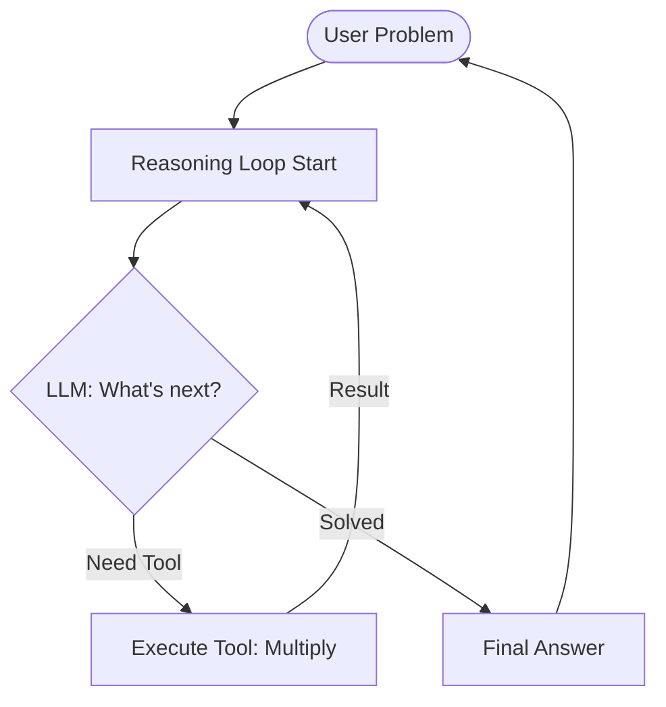

# Lab 5 Summary: Reasoning & Agentic Loops

This document explores the implementation of a **Reasoning Math Agent**, focusing on autonomous multi-step problem solving and functional tool calling.

## 🚀 Overview

Lab 5 introduces the most advanced pattern yet: the **Reasoning Loop**. Unlike previous chatbots that respond in a single turn, this agent is **Iterative**. It reasons about a problem, decides to take an action (calling a tool), observes the result, and repeats until the goal is achieved.

---

## 1. The Reasoning Loop (ReAct)
**Examples:** [reasoning_agent.py](file:///Users/ivanp/Downloads/openai-bot/Lab-5/reasoning_agent/reasoning_agent.py)

The agent follows a **ReAct** (Reason + Act) pattern. It uses the LLM's "thought process" to determine which tool to call and how to interpret the results.

### Mermaid: Iterative Reasoning Loop

---

## 2. Tool Calling & Structured Data
**Examples:** [tools.py](file:///Users/ivanp/Downloads/openai-bot/Lab-5/reasoning_agent/tools.py), [utils.py](file:///Users/ivanp/Downloads/openai-bot/Lab-5/reasoning_agent/utils.py)

This lab demonstrates how to give an LLM "arms" through **Function Calling**.
- **The Registry**: `tools.py` defines the function schema (JSON) that OpenAI understands.
- **The Observation**: When a tool is called, the result is fed back into the conversation as a `user` role (or `tool` role in newer APIs) so the model can "observe" its own action's effect.

---

## 3. Separation of Concerns
**Architecture Breakdown:**

| Component | Responsibility | Technical Implementation |
| :--- | :--- | :--- |
| **Engine** | Loop Logic | `run_reasoning_loop()` (while-loop with max iterations) |
| **Infrastructure** | Tools | `execute_tool()` router mapping JSON to Python functions |
| **State** | History | Growing list of `messages` containing thoughts and results |
| **UI** | Interaction | Streamlit `st.expander` for collapsible reasoning steps |

---

## 🛠️ CS Technical Notes

- **Termination & Convergence**: To prevent infinite loops (and infinite bills), the engine implements a `max_iterations=10` constraint. This is a critical safety pattern for autonomous agents.
- **Structured Output Parsing**: The system parses the model's raw response into "Reasoning Steps" and "Tool Calls". This makes the agent's internal state machine inspectable by the user.
- **Property-Based Testing**: Lab 5 includes `test_integration.py`, which uses property checking to ensure the agent converges on the correct answer across a wide range of numeric inputs.
- **Latency vs. Accuracy**: Because each reasoning step is a new API call, this pattern is slower than a direct chat. However, it is significantly more accurate for logic-heavy tasks (like math) where the model might otherwise "hallucinate" an incorrect answer.
