# Planning Your First Chatbot

## 1. Identify Your Business Goals
A chatbot is a **business system**, not a demo. Start with *why*, not features.

**Key points**
- Goals should be specific, measurable, and user-centered
- Focus on the pain removed if the chatbot works well

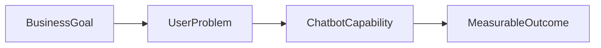

---

## 2. Ask Yourself the Right Questions
Clear boundaries matter more than clever AI.

**Questions to ask**
- What should the bot do?
- What should it not do?
- When should a human take over?

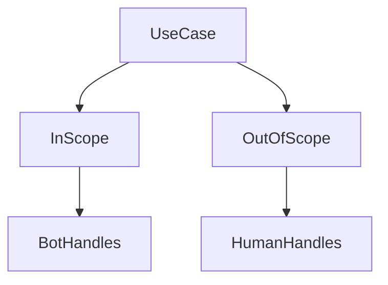

---

## 3. Avoid Doing Everything in One Flow
Monolithic flows are fragile and confusing.

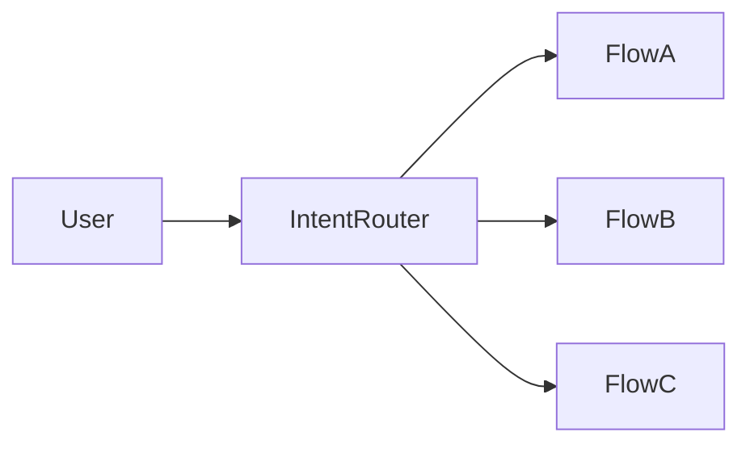

---

## 4. Use SMART Goals to Stay Focused
SMART goals prevent overbuilding.

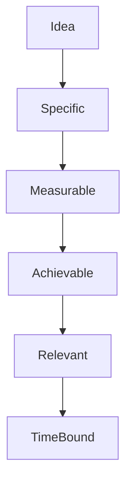

---

## 5. Map the Ideal User Journey
Design for clarity, not conversation length.

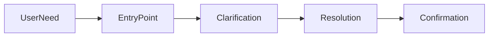

---

## 6. Choose a Mapping Process
Tools matter less than shared understanding.

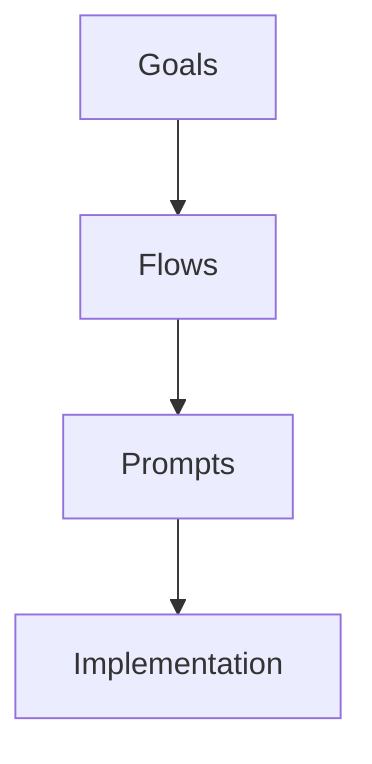

---

## 7. Avoid Common Mistakes
Most failures come from over-scope.

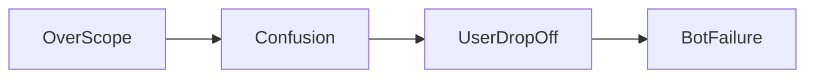

---

## 8. Reuse Common Flow Patterns
Do not reinvent patterns.

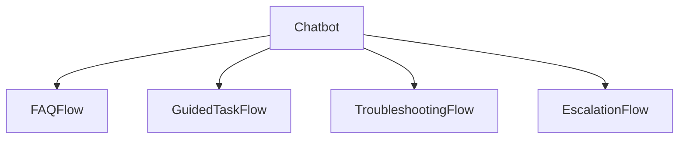

---

## 9. Start Simple
Earn intelligence by being boring first.

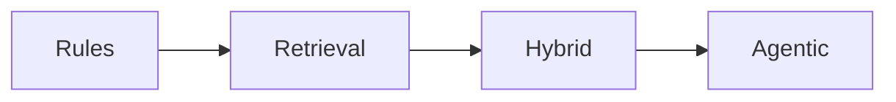

---

## 10. Orchestrate Multiple Flows
Real systems route, not chat blindly.

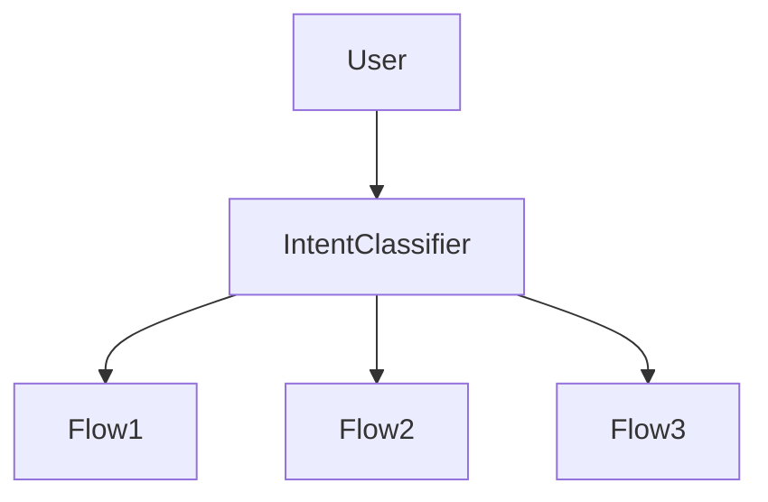

---

## 11. Assemble the Right Team
Chatbots are socio-technical systems.

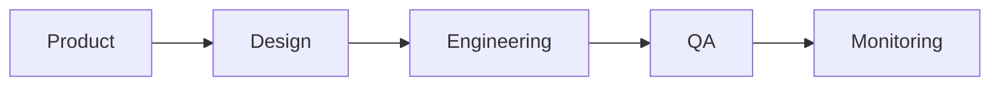

---

## 12. Choose the Right Platform
Platforms follow use cases, not hype.

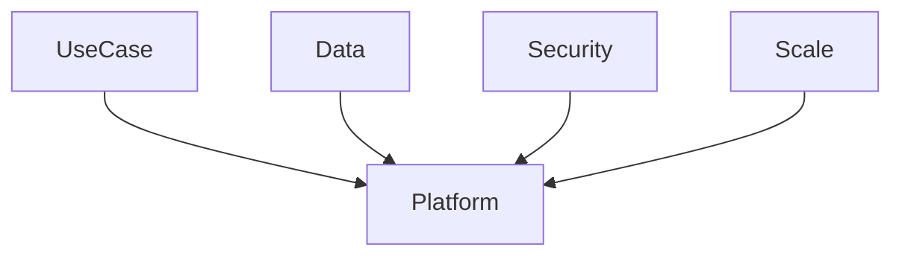

---

## Final Takeaway
A chatbot planned well feels simple to users — and boring to builders.
