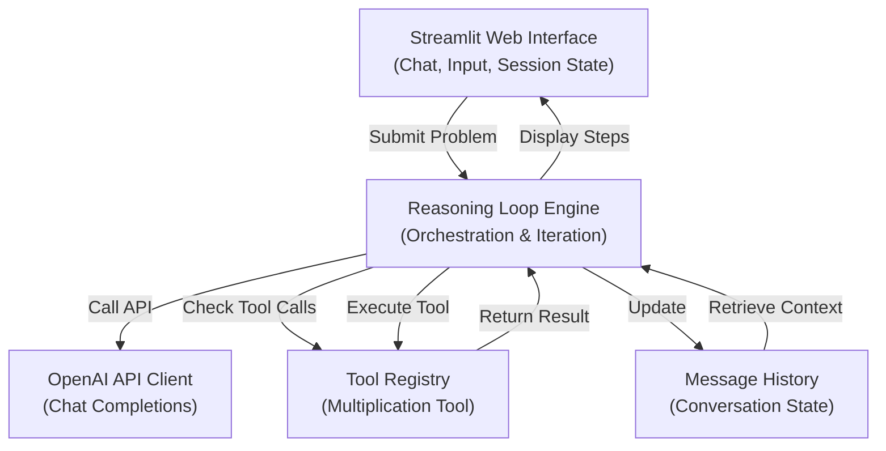
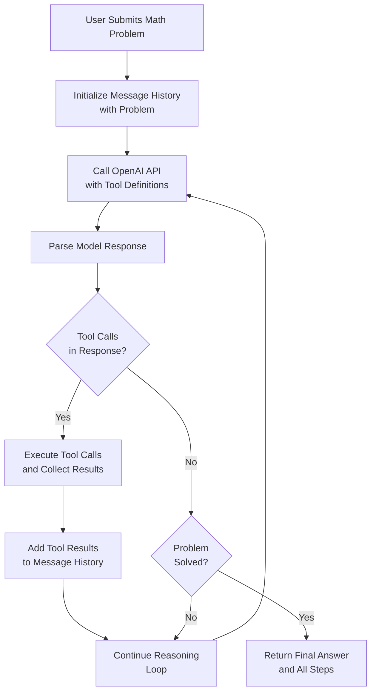

# Design Document: Reasoning Math Agent

## Overview

The Reasoning Math Agent is a Streamlit-based web application that demonstrates agentic reasoning patterns. The agent uses OpenAI's function calling capabilities to solve math problems step-by-step, invoking a multiplication tool when needed and showing its complete reasoning process to the user.

The core innovation is the **reasoning loop**: the agent iteratively reasons about a problem, decides whether to call tools, processes tool results, and determines when the problem is solved. This pattern is fundamental to building autonomous agents.

## Architecture

### System Architecture Diagram



### Reasoning Loop Flow Diagram



### Message Flow in Reasoning Loop

```mermaid
sequenceDiagram
    participant User
    participant UI as Streamlit UI
    participant Loop as Reasoning Loop
    participant OpenAI as OpenAI API
    participant Tools as Tool Registry
    
    User->>UI: Submit Math Problem
    UI->>Loop: run_reasoning_loop(problem)
    Loop->>OpenAI: POST /chat/completions<br/>(with tools)
    OpenAI-->>Loop: Response with tool_calls
    Loop->>Tools: Execute multiply(a, b)
    Tools-->>Loop: Result
    Loop->>OpenAI: POST /chat/completions<br/>(with tool result)
    OpenAI-->>Loop: Response with reasoning
    Loop->>Loop: Check if solved
    alt Problem Solved
        Loop-->>UI: Final solution with all steps
        UI->>User: Display complete reasoning
    else More Steps Needed
        Loop->>OpenAI: Continue reasoning loop
    end
```

## Components and Interfaces

### 1. Streamlit UI Component
- **File**: `app.py`
- **Responsibilities**:
  - Display chat interface with message history
  - Accept user input for math problems
  - Stream reasoning steps and final answers
  - Manage session state for conversation history
  - Provide clear visual separation between reasoning steps and final answer

### 2. Reasoning Loop Engine
- **File**: `reasoning_agent.py`
- **Core Function**: `run_reasoning_loop(problem: str, messages: list) -> dict`
- **Responsibilities**:
  - Maintain the agentic reasoning loop
  - Call OpenAI API with function definitions
  - Parse tool calls from model responses
  - Execute tools and collect results
  - Determine when reasoning is complete
  - Return structured reasoning output with all steps

### 3. Tool Registry
- **File**: `tools.py`
- **Responsibilities**:
  - Define available tools (multiplication tool)
  - Provide tool definitions in OpenAI function calling format
  - Execute tool calls and return results
  - Validate tool inputs

### 4. Utilities Module
- **File**: `utils.py`
- **Responsibilities**:
  - OpenAI API client initialization
  - Message formatting helpers
  - Tool result formatting
  - Logging and debugging utilities

## Data Models

### Message Format
```python
{
    "role": "user" | "assistant" | "system",
    "content": str,
    "tool_calls": [  # Optional, only for assistant messages
        {
            "id": str,
            "function": {
                "name": str,
                "arguments": str  # JSON string
            }
        }
    ]
}
```

### Tool Definition Format (OpenAI Function Calling)
```python
{
    "type": "function",
    "function": {
        "name": "multiply",
        "description": "Multiply two numbers",
        "parameters": {
            "type": "object",
            "properties": {
                "a": {"type": "number", "description": "First number"},
                "b": {"type": "number", "description": "Second number"}
            },
            "required": ["a", "b"]
        }
    }
}
```

### Reasoning Step Output
```python
{
    "step_number": int,
    "reasoning": str,
    "tool_called": bool,
    "tool_name": str | None,
    "tool_input": dict | None,
    "tool_result": str | None,
    "is_final": bool
}
```

### Complete Solution Output
```python
{
    "problem": str,
    "steps": [ReasoningStep],
    "final_answer": str,
    "total_iterations": int,
    "tools_used": [str]
}
```

## Error Handling

1. **Invalid Math Problem**: If user input is not a valid math problem, the agent should recognize this and ask for clarification
2. **Tool Execution Errors**: If multiplication tool receives invalid inputs, return error message and continue reasoning
3. **API Errors**: Handle OpenAI API failures gracefully with user-friendly error messages
4. **Infinite Loop Protection**: Limit reasoning iterations to prevent infinite loops (max 10 iterations)
5. **Malformed Tool Calls**: If model generates invalid tool calls, catch and handle gracefully

## Testing Strategy

### Unit Testing
- Test multiplication tool with various inputs (positive, negative, zero, decimals)
- Test message formatting and parsing
- Test tool definition generation
- Test error handling for invalid inputs

### Property-Based Testing
We will use `hypothesis` for property-based testing to verify:
- Multiplication tool correctness across all numeric inputs
- Message history consistency after each reasoning step
- Tool call parsing and execution
- Reasoning loop termination conditions

### Integration Testing
- End-to-end reasoning loop with sample math problems
- Verify complete solution output structure
- Test conversation history persistence across multiple problems
- Test UI interaction flow

### Test Configuration
- Minimum 100 iterations per property-based test
- Use `hypothesis` library for Python
- Tag each test with requirement references
- Mock OpenAI API calls for deterministic testing where appropriate


## Correctness Properties

A property is a characteristic or behavior that should hold true across all valid executions of a system—essentially, a formal statement about what the system should do. Properties serve as the bridge between human-readable specifications and machine-verifiable correctness guarantees.

### Property 1: Problem Acceptance and Processing
*For any* valid math problem string, submitting it to the reasoning agent should initiate the reasoning process and produce a non-empty list of reasoning steps.

**Validates: Requirements 1.1**

**Reasoning**: This property ensures that the agent can accept and begin processing any math problem. We verify this by checking that the reasoning loop starts and generates at least one step.

### Property 2: Sequential Reasoning Steps
*For any* completed reasoning solution, the reasoning steps should be numbered sequentially starting from 1 with no gaps, and each step should contain reasoning content.

**Validates: Requirements 1.2**

**Reasoning**: This property ensures that reasoning steps are generated in order and are complete. We verify by checking step numbering and that each step has content.

### Property 3: Final Answer Presence
*For any* completed reasoning solution, the output should contain a final answer field that is non-empty and distinct from intermediate reasoning steps.

**Validates: Requirements 1.3**

**Reasoning**: This property ensures that every solution has a clear final answer. We verify by checking that the final_answer field exists and is populated.

### Property 4: Complete Solution Preservation
*For any* math problem processed by the agent, the solution output should contain all reasoning steps that were generated, preserving the complete thought process from problem to answer.

**Validates: Requirements 1.4**

**Reasoning**: This property ensures no reasoning steps are lost. We verify by checking that the steps list contains all intermediate reasoning.

### Property 5: Reasoning Loop Termination
*For any* math problem, the reasoning loop should eventually terminate with a final answer within a maximum of 10 iterations, preventing infinite loops.

**Validates: Requirements 3.2, 3.4**

**Reasoning**: This property ensures the loop has a termination condition and doesn't run forever. We verify by checking that total_iterations is less than or equal to 10 and a final answer exists.

### Property 6: Multiplication Tool Correctness
*For any* two numeric inputs a and b, calling the multiplication tool should return a result equal to a × b.

**Validates: Requirements 6.2**

**Reasoning**: This property ensures the tool performs correct arithmetic. We verify by checking that multiply(a, b) == a * b for all numeric inputs.

### Property 7: Tool Result Integration
*For any* reasoning solution that uses the multiplication tool, the tool result should appear in the message history after the tool call, and the final answer should reflect the tool's computation.

**Validates: Requirements 6.3**

**Reasoning**: This property ensures tool results are incorporated into reasoning. We verify by checking that tool results appear in messages and influence the final answer.

### Property 8: Tool Usage Tracking
*For any* completed reasoning solution, the tools_used list should accurately reflect all tools that were invoked during the reasoning process, with each tool appearing exactly once.

**Validates: Requirements 6.4**

**Reasoning**: This property ensures tool usage is properly tracked. We verify by checking that tools_used contains all invoked tools with no duplicates.
