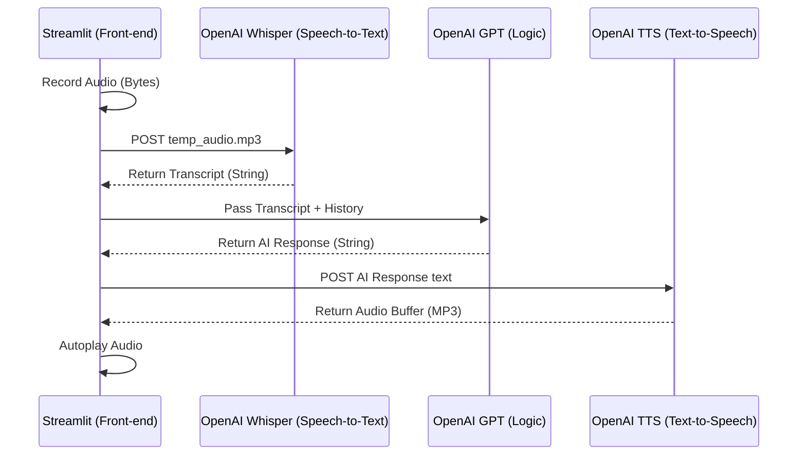

# Voice Summary: Multi-Modal AI Pipelines

This document details the technical implementation of a **Voice-to-Voice** chatbot, orchestrating three distinct AI models into a single conversational loop.

## 🚀 Overview

The `voice` folder demonstrates **Multi-Modal Orchestration**. We move beyond text buffers (`string`) to handle raw audio data (`bytes`), requiring precise timing and file I/O management.

---

## 1. The Multi-Modal Pipeline
**Examples:** [voice_bot.py](file:///Users/ivanp/Downloads/openai-bot/voice/voice_bot.py), [utils.py](file:///Users/ivanp/Downloads/openai-bot/voice/utils.py)

The system functions as a pipe where data changes modality at each stage. This is often referred to as a **Cascade** approach to Voice AI.

### Mermaid: Modality Transformation Sequence

---

## 2. Technical Components

### A. Audio Recording (`audio_recorder`)
Streamlit is primarily a data-dashboarding tool. To capture microphone input, we use the `audio_recorder_streamlit` component.
- **Data Flow**: The component captures PCM data and returns it as a Python `bytes` object.
- **UX Integration**: `streamlit_float` is used to keep the microphone icon fixed at the bottom of the screen regardless of chat length.

### B. Modality Translation (`utils.py`)
- **Whisper-1**: Converts irregular audio frequencies into structured text tokens.
- **TTS-1**: Performs high-fidelity neural speech synthesis. 
- **Wait/Think Logic**: Note the several `st.spinner` calls in `voice_bot.py` ([L34, L48, L50](file:///Users/ivanp/Downloads/openai-bot/voice/voice_bot.py#L34-L50)) which manage user expectations during these high-latency transformations.

---

## 🛠️ CS Technical Notes

- **Modality Chaining & Latency**: Each API call (STT, LLM, TTS) introduces network overhead. In a production CS environment, you would look into **WebSockets** or **gRPC** for streaming audio chunks rather than waiting for whole files.
- **Temporary Buffer Management**: Notice the `os.remove()` calls in `voice_bot.py` ([L44, L55](file:///Users/ivanp/Downloads/openai-bot/voice/voice_bot.py#L44-L55)). Python scripts handling media files must manage disk space to avoid filling up the server's storage with temporary MP3 files.
- **Async vs. Blocking**: Streamlit's execution model is blocking. The UI stops updating until `get_answer` or `text_to_speech` returns. 
- **HTML5 Audio Injection**: Since Streamlit doesn't have a native "autoplay" command for audio files, we use **Base64 Encoding** to inject a hidden `<audio autoplay>` tag into the DOM via `st.markdown`.
- **Statelessness in Voice**: Even with audio, we still rely on the `st.session_state.messages` text-list to maintain "Long-term" memory between voice turns.
