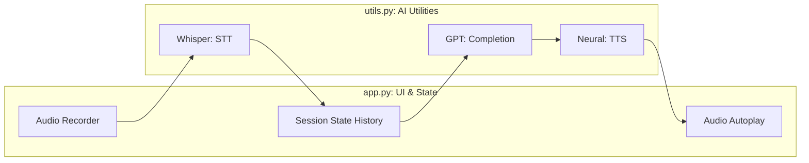

# Voice Code Summary: Modular AI Architectures

This document highlights the **Modular Design** of the voice-enabled chatbot, emphasizing the separation of concerns between UI rendering and AI utility logic.

## 🚀 Overview

The `voice_code` folder provides a "clean room" implementation of the Voice-to-Voice pipeline. For CS students, the primary lesson here is **Modularity**—how to structure an AI application so that the front-end and the AI models can evolve independently.

---

## 1. Modular Architecture
**Examples:** [app.py](file:///Users/ivanp/Downloads/openai-bot/voice_code/app.py), [utils.py](file:///Users/ivanp/Downloads/openai-bot/voice_code/utils.py)

By moving complex model interactions (Whisper, GPT-3.5, TTS) into `utils.py`, the `app.py` file remains focused on **State Management** and **User Interface**.

### Mermaid: Component Responsibility

---

## 2. Technical Comparison: `voice` vs. `voice_code`

While the underlying models are identical to the `voice` lab, `voice_code` serves as a template for **Production Refactoring**.

| Feature | Concept | Implementation Note |
| :--- | :--- | :--- |
| **Separation of Concerns** | UI vs. Logic | `app.py` handles the "What", `utils.py` handles the "How". |
| **Encapsulation** | API Keys | `load_dotenv()` is central in `utils.py`, keeping the UI code clean. |
| **Buffer Handling** | File I/O | Standardized use of `temp_audio.mp3` for modality transitions. |

---

## 🛠️ CS Technical Notes

- **The Factory Pattern**: `utils.py` acts as a simplified factory for AI responses. If you wanted to swap OpenAI's TTS for an open-source model (like Coqui), you would only need to change one function in `utils.py`, leaving the UI code untouched.
- **Dependency Management**: The `requirements.txt` file ensures that the specific versions of `audio_recorder_streamlit` and `streamlit_float` are pinned, preventing breaking changes in the reactive UI components.
- **State Persistence**: Like previous labs, it leverages `st.session_state` ([L11-14](file:///Users/ivanp/Downloads/openai-bot/voice_code/app.py#L11-14)). For advanced CS projects, this state could be serialized to JSON and sent to a persistent database for cross-device memory.
- **Cleanup Routine**: Rigorous cleanup of temporary audio files ([L44, L55](file:///Users/ivanp/Downloads/openai-bot/voice_code/app.py#L44-L55)) is a best practice for managing file handles and storage on server-side Streamlit instances.
