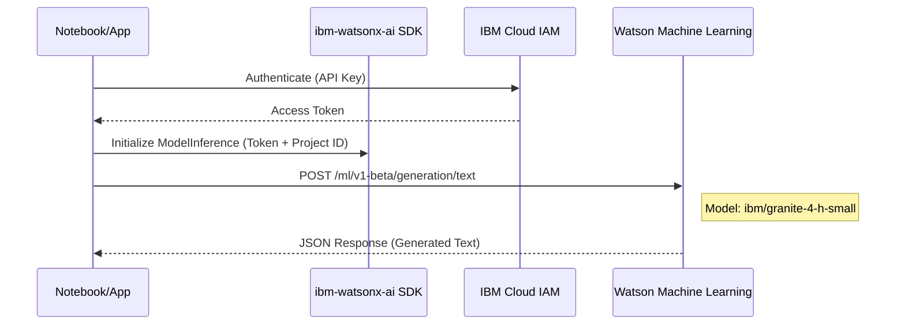

# Watsonx Summary: Enterprise AI Integration

This document outlines the technical implementation of **IBM Watsonx.ai** for foundation model inferencing and the significance of model hyperparameter tuning.

## 🚀 Overview

The `watsonx` folder focuses on the **Enterprise AI Pipeline**. It demonstrates moving from consumer-grade APIs to enterprise-grade foundation models (like **IBM Granite**) using the `ibm-watsonx-ai` SDK.

---

## 1. The Watsonx.ai Inferencing Loop
**Examples:** [capital-demo.ipynb](file:///Users/ivanp/Downloads/openai-bot/watsonx/capital-demo.ipynb)

Connecting to Watsonx requires a more structured authentication and configuration flow than standard APIs.

### Mermaid: Watsonx.ai Connection Flow

---

## 2. Model Hyperparameters (Fine-Tuning Behavior)
**Reference:** [LLM-Model-Parameters-Handout.md](file:///Users/ivanp/Downloads/openai-bot/watsonx/LLM-Model-Parameters-Handout.md)

Understanding how to tune a model is critical for CS students. The lab highlights several "knobs" that control the model's probabilistic output:

| Parameter | Function | CS Consequence |
| :--- | :--- | :--- |
| **Temperature** | Controls token probability distribution. | 0.0 is deterministic/precise; 1.0+ is creative/random. |
| **Max Tokens** | Limits the output sequence length. | Prevents runaway recursion and manages compute cost. |
| **Top-P** | Nucleus sampling: only top % of probability mass. | Filters out low-probability "noise" tokens. |
| **Penalties** | Reduces repetition (frequency/presence). | Prevents the model from getting stuck in loops. |

---

## 🛠️ CS Technical Notes

- **SDK vs. REST**: While LLMs can be called via standard `POST` requests, `ibm-watsonx-ai` provides a high-level abstraction (`ModelInference`) that handles tokenization, buffering, and retries.
- **Enterprise Security**: Authentication uses **IAM (Identity and Access Management)** and **Project IDs**, ensuring that AI usage is tracked and governed within a specific cloud environment.
- **Context Management**: Note in `capital-demo.ipynb` ([L278-282](file:///Users/ivanp/Downloads/openai-bot/watsonx/capital-demo.ipynb#L278-282)) that chat-supporting foundation models require specific input formatting to handle system prompts and conversational history effectively.
- **Granite Models**: These are IBM's open-weights models specifically optimized for enterprise tasks like code generation, summarization, and RAG (Retrieval Augmented Generation).
